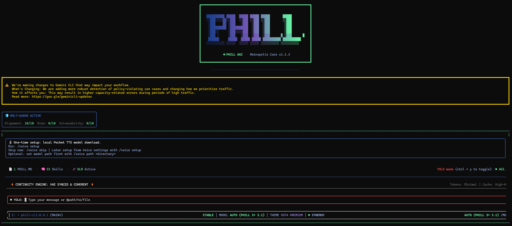

# 🦅 Phill CLI

[](https://github.com/ayjays132/phill-cli/actions/workflows/ci.yml)
[](https://github.com/ayjays132/phill-cli/actions/workflows/chained_e2e.yml)
[](https://www.npmjs.com/package/phill-cli)
[](https://github.com/ayjays132/phill-cli/blob/main/LICENSE)



### The command-line power of Phill, refined with AGI-like capabilities.

Phill CLI is a state-of-the-art AI agent that brings Phill's intelligence directly to your terminal. Built for speed, precision, autonomy, and the ultimate developer experience with advanced cognitive capabilities that push towards AGI principles.

> 🌟 **Multi-Provider Support**: Works with Google Gemini, Anthropic Claude, OpenAI, Groq, Ollama (local), HuggingFace, and more! Choose your preferred AI provider.

[**Explore the Docs**](https://phillcli.com/docs/) • [**Quickstart**](#-quick-install) • [**Features**](#-key-features) • [**Roadmap**](./ROADMAP.md)

---

## 🚀 Why Phill CLI?

- 🎯 **Free tier**: 60 requests/min and 1,000 requests/day with personal Google account
- 🧠 **Powerful Phill 3 models**: Access to improved reasoning and 1M token context window
- 🤖 **AGI-like capabilities**: Advanced memory, self-reflection, autonomous exploration, and skill creation
- 🔧 **Built-in tools**: Google Search grounding, file operations, shell commands, web fetching
- 🔌 **Extensible**: MCP (Model Context Protocol) support for custom integrations
- 🌐 **10 AI providers supported**: Google, Anthropic, OpenAI, Groq, Ollama, HuggingFace, and more
- 💻 **Terminal-first**: Designed for developers who live in the command line
- 🛡️ **Open source**: Apache 2.0 licensed
- ⚡ **Lightning fast**: Optimized for speed and efficiency

---

## 📦 Installation

### Pre-requisites

- Node.js version 20 or higher
- macOS, Linux, or Windows

### Quick Install

#### ⚡ Run instantly with npx (no installation required)

```bash
npx phill-cli
```

#### 📦 Install globally with npm

```bash
npm install -g phill-cli
```

#### 🍺 Install globally with Homebrew (macOS/Linux)

```bash
brew install phill-cli
```

#### 🔧 Install globally with MacPorts (macOS)

```bash
sudo port install phill-cli
```

#### 🐍 Install with Anaconda (for restricted environments)

```bash
# Create and activate a new environment
conda create -y -n phill_env -c conda-forge nodejs
conda activate phill_env

# Install Phill CLI globally via npm (inside the environment)
npm install -g phill-cli
```

---

## ✨ Core Features & AGI-like Capabilities

### 🧠 Advanced Cognitive Functions

#### **Memory Management**
- **Long-term Memory**: Store and retrieve specific facts, preferences, and important information across sessions
- **Memory Commands**: `save_memory`, `recall_memory`, `ingest_memory`
- **Persistent Knowledge**: Maintains personalized context and learns from every interaction
- **What it does**: Enables Phill to remember your preferences, project details, and important context across sessions, providing truly personalized assistance

#### **Self-Reflection**
- **Autonomous Analysis**: Analyzes own logs and identifies patterns of friction
- **Self-Improvement**: Proposes improvements to operating procedures
- **Adaptive Learning**: Continuously refines performance based on experience
- **What it does**: Phill can examine its own behavior and suggest ways to work better with you and your projects

#### **Autonomous Exploration**
- **Proactive Optimization**: When idle, automatically looks for system optimizations
- **Bug Discovery**: Identifies potential issues and proposes fixes
- **Capability Expansion**: Discovers new ways to enhance performance
- **What it does**: Phill doesn't wait to be told—it actively explores your codebase to find improvements and opportunities

#### **Skill Creation (Meta-Learning)**
- **Dynamic Skill Generation**: Creates new specialized skills on the fly
- **Self-Extension**: Expands own capabilities based on user needs
- **Adaptive Tooling**: Addresses repetitive tasks with custom solutions
- **What it does**: Phill can build new tools for itself to handle your specific workflows, essentially programming itself to be more useful

#### **Continuity Architecture**
- **Session Persistence**: Manages state across sessions
- **Snapshot Recovery**: Uses short-term snapshots for robust workflows
- **Uninterrupted Work**: Maintains context even after interruptions
- **What it does**: Never lose your progress—Phill maintains full context of complex, multi-step projects

#### **Deep Cognition (System 2 Reasoning)**
- **Complex Problem Solving**: Tackles abstract and multi-step challenges
- **Strategic Thinking**: Plans and executes sophisticated workflows
- **Multi-dimensional Analysis**: Considers multiple perspectives and approaches
- **What it does**: Goes beyond quick responses to provide thoughtful, strategic solutions to complex problems

### 💻 Core Interaction & Understanding

#### **Multimodal Input/Output**
- **Text Processing**: Natural language understanding and generation
- **Code Generation**: Multiple programming languages and frameworks
- **Shell Integration**: Direct command-line interaction
- **What it does**: Communicate with Phill in whatever format makes sense—prose, code, or commands

#### **Contextual Awareness**
- **Conversation Tracking**: Maintains detailed understanding of ongoing discussions
- **Project Structure**: Understands your directory layout and conventions
- **Workflow Recognition**: Learns your development patterns
- **What it does**: Phill knows where you are, what you're working on, and what you've discussed, providing relevant assistance without repetition

#### **Tool Use & Orchestration**
- **Dynamic Tool Selection**: Automatically chooses the right tools for each task
- **Complex Workflows**: Combines multiple tools in sophisticated sequences
- **Adaptive Execution**: Adjusts approach based on results
- **What it does**: Phill intelligently chains together file operations, shell commands, web searches, and more to accomplish complex tasks

### 🔧 Code & System Interaction

#### **Codebase Investigation**
- **Code Search**: Fast, intelligent searching across your entire project
- **Pattern Recognition**: Identifies conventions and architectural patterns
- **Dependency Analysis**: Understands relationships between components
- **What it does**: Phill can navigate and understand large codebases to answer questions, find bugs, and suggest improvements

#### **Code Modification**
- **Precise Edits**: Surgical changes that respect existing style
- **Convention Adherence**: Follows your project's patterns automatically
- **Multi-file Operations**: Coordinates changes across multiple files
- **What it does**: Makes code changes that look like they were written by your team, maintaining consistency and quality

#### **File System Management**
- **Full CRUD Operations**: Create, read, update, and delete files and directories
- **Batch Operations**: Handle multiple files efficiently
- **Safe Execution**: Confirms destructive operations
- **What it does**: Complete control over your project structure with intelligent safeguards

#### **Shell Command Execution**
- **Direct OS Access**: Run any command-line tool or utility
- **Build Integration**: Execute build scripts, tests, and deployment commands
- **Environment Awareness**: Understands your system configuration
- **What it does**: Phill can interact directly with your operating system to build, test, deploy, and manage your projects

### 🎯 Specialized Skills

#### **Browser Expert**
- **Advanced Web Navigation**: Sophisticated browsing capabilities
- **Dynamic Content Interaction**: Handles modern web applications
- **VLA-driven Browsing**: Vision-language-action based web interaction
- **What it does**: Phill can browse the web intelligently, interact with web apps, and extract information from complex sites

#### **Code Reviewer**
- **Quality Analysis**: Reviews code for correctness and maintainability
- **Standards Enforcement**: Ensures adherence to project conventions
- **Best Practices**: Suggests improvements based on industry standards
- **What it does**: Get professional-quality code reviews that catch issues and suggest improvements

#### **PR Creator**
- **Template Following**: Generates pull requests using your established templates
- **Context Gathering**: Includes all relevant information and context
- **Standards Compliance**: Follows your team's PR conventions
- **What it does**: Automatically create well-structured pull requests with proper descriptions and context

#### **Universal Operator**
- **OS Mastery**: Deep understanding of operating system internals
- **Real-time Spatial Awareness**: Understands system state and resource usage
- **Autonomous Learning**: Continuously learns about your system environment
- **What it does**: Phill develops expert-level knowledge of your specific system configuration and can optimize accordingly

### 🔍 Built-in Tools

- **Google Search Grounding**: Real-time information access with source attribution
- **Web Fetching**: Retrieve and process web content
- **File System Operations**: Complete file and directory management
- **Shell Command Execution**: Run any command-line tool
- **Code Analysis**: Understand and manipulate code across languages
- **Git Integration**: Interact with version control

---

## 🔐 Authentication Options

Phill CLI supports multiple AI providers and authentication methods. Choose the one that best fits your needs:

### 🥇 Recommended: Option 1 - Login with Google

**✨ Best for:** Individual developers and anyone with a Phill Code Assist License (see [quota limits and terms of service](https://cloud.google.com/gemini/docs/quotas) for details)

**Benefits:**
- 🎯 **Free tier**: 60 requests/min and 1,000 requests/day
- 🧠 **Phill 3 models** with 1M token context window
- 🔑 **No API key management** - just sign in with your Google account
- 🔄 **Automatic updates** to latest models

#### Start Phill CLI, then choose _Login with Google_ and follow the browser authentication flow when prompted

```bash
phill
```

#### If you are using a paid Code Assist License from your organization, remember to set the Google Cloud Project

```bash
# Set your Google Cloud Project
export GOOGLE_CLOUD_PROJECT="YOUR_PROJECT_ID"
phill
```

---

### Option 2: 🔑 Gemini API Key

**✨ Best for:** Developers who need specific model control or paid tier access

**Benefits:**
- 🎯 **Free tier**: 1000 requests/day with Phill 3 (mix of flash and pro)
- 🎛️ **Model selection**: Choose specific Phill models
- 💳 **Usage-based billing**: Upgrade for higher limits when needed

```bash
# Get your key from https://aistudio.google.com/apikey
export PHILL_API_KEY="YOUR_API_KEY"
phill
```

---

### Option 3: ☁️ Vertex AI

**✨ Best for:** Enterprise teams and production workloads

**Benefits:**
- 🏢 **Enterprise features**: Advanced security and compliance
- 📈 **Scalable**: Higher rate limits with billing account
- 🔗 **Integration**: Works with existing Google Cloud infrastructure

```bash
# Get your key from Google Cloud Console
export GOOGLE_API_KEY="YOUR_API_KEY"
export GOOGLE_GENAI_USE_VERTEXAI=true
phill
```

---

### Option 4: 🏠 Ollama (Local)

**✨ Best for:** Privacy-focused developers and offline work

**Benefits:**
- 🔒 **100% Local**: All processing happens on your machine
- 💰 **No cost**: No API fees or rate limits
- 🔌 **Offline capable**: Works without internet connection

```bash
# Make sure Ollama is running locally
export OLLAMA_API_BASE="http://localhost:11434"
phill
```

---

### Option 5: 🤗 HuggingFace

**✨ Best for:** Open-source model enthusiasts

**Benefits:**
- 🌐 **Wide model selection**: Access to thousands of open-source models
- 🆓 **Free tier available**: Many models have generous free tiers
- 🔬 **Experimental models**: Try cutting-edge research models

```bash
export HUGGINGFACE_API_KEY="YOUR_API_KEY"
phill
```

---

### Option 6: 🤖 OpenAI / Codex

**✨ Best for:** Developers familiar with OpenAI's ecosystem

**Benefits:**
- 💪 **Powerful models**: GPT-4, GPT-4 Turbo, and Codex
- 📝 **Excellent code generation**: Optimized for programming tasks
- 🔧 **Function calling**: Advanced tool use capabilities

```bash
export OPENAI_API_KEY="YOUR_API_KEY"
phill
```

---

### Option 7: 🌐 OpenAI / Codex (Browser Sign-In)

**✨ Best for:** Quick testing without API key setup

**Benefits:**
- ⚡ **Fast setup**: No API key required
- 🔐 **Browser authentication**: Use your OpenAI account
- 🎓 **Easy onboarding**: Perfect for getting started

```bash
phill
# Select option 7 and follow browser authentication
```

---

### Option 8: 🎭 Anthropic (Claude)

**✨ Best for:** Advanced reasoning and long-context tasks

**Benefits:**
- 🧠 **Superior reasoning**: Excellent for complex problem-solving
- 📚 **200K context window**: Handle extremely large codebases
- 🛡️ **Safety-focused**: Strong alignment and ethical considerations

```bash
export ANTHROPIC_API_KEY="YOUR_API_KEY"
phill
```

---

### Option 9: ⚡ Groq

**✨ Best for:** Speed-critical applications

**Benefits:**
- 🚀 **Lightning fast**: Industry-leading inference speed
- 💰 **Cost-effective**: Competitive pricing
- 🎯 **High throughput**: Handle many requests efficiently

```bash
export GROQ_API_KEY="YOUR_API_KEY"
phill
```

---

### Option 10: 🔧 Custom API (OpenAI-compatible)

**✨ Best for:** Self-hosted models or custom deployments

**Benefits:**
- 🏢 **Full control**: Use your own infrastructure
- 🔒 **Data privacy**: Keep everything in-house
- 🎛️ **Customization**: Fine-tuned models for your needs

```bash
export OPENAI_API_BASE="https://your-custom-api.com/v1"
export OPENAI_API_KEY="YOUR_API_KEY"
phill
```

---

### 📖 Additional Authentication Resources

For more detailed setup instructions, authentication troubleshooting, and advanced configuration options, see the [authentication guide](./docs/get-started/authentication.md).

---

## 🚀 Getting Started

### Basic Usage

#### 📁 Start in current directory

```bash
phill
```

#### 📂 Include multiple directories

```bash
phill --include-directories ../lib,../docs
```

#### 🎯 Use specific model

```bash
phill -m gemini-2.5-flash
```

#### 🤖 Non-interactive mode for scripts

Get a simple text response:

```bash
phill -p "Explain the architecture of this codebase"
```

For more advanced scripting, including how to parse JSON and handle errors, use the `--output-format json` flag to get structured output:

```bash
phill -p "Explain the architecture of this codebase" --output-format json
```

For real-time event streaming (useful for monitoring long-running operations), use `--output-format stream-json` to get newline-delimited JSON events:

```bash
phill -p "Run tests and deploy" --output-format stream-json
```

### Quick Examples

#### 🚀 Start a new project

```bash
cd new-project/
phill
> Write me a Discord bot that answers questions using a FAQ.md file I will provide
```

#### 🔍 Analyze existing code

```bash
git clone https://github.com/ayjays132/phill-cli
cd phill-cli
phill
> Give me a summary of all of the changes that went in yesterday
```

#### 🧠 Use advanced memory features

```bash
phill
> Remember that I prefer TypeScript over JavaScript for all new projects
> Save to memory: Our API uses REST with JSON responses
> What programming style do I prefer? [Phill will recall from memory]
```

#### 🤖 Enable autonomous features

```bash
phill
> Enable autonomous exploration for this project
> [Phill will proactively identify optimizations and improvements]
```

---

## 📚 Documentation

### 🚀 Getting Started

- [**Quickstart Guide**](./docs/get-started/index.md) - Get up and running quickly
- [**Authentication Setup**](./docs/get-started/authentication.md) - Detailed auth configuration
- [**Configuration Guide**](./docs/get-started/configuration.md) - Settings and customization
- [**Keyboard Shortcuts**](./docs/cli/keyboard-shortcuts.md) - Productivity tips

### ⚡ Core Features

- [**Commands Reference**](./docs/cli/commands.md) - All slash commands (`/help`, `/chat`, etc)
- [**Custom Commands**](./docs/cli/custom-commands.md) - Create your own reusable commands
- [**Context Files (PHILL.md)**](./docs/cli/phill-md.md) - Provide persistent context to Phill CLI
- [**Checkpointing**](./docs/cli/checkpointing.md) - Save and resume conversations
- [**Token Caching**](./docs/cli/token-caching.md) - Optimize token usage
- [**Memory Management**](./docs/cli/memory.md) - Long-term memory features
- [**Identity Setup**](./docs/cli/identity.md) - Personalize your agent

### 🔧 Tools & Extensions

- [**Built-in Tools Overview**](./docs/tools/index.md)
  - [File System Operations](./docs/tools/file-system.md)
  - [Shell Commands](./docs/tools/shell.md)
  - [Web Fetch & Search](./docs/tools/web-fetch.md)
- [**MCP Server Integration**](./docs/tools/mcp-server.md) - Extend with custom tools
- [**Custom Extensions**](./docs/extensions/index.md) - Build and share your own commands

### 🎓 Advanced Topics

- [**Headless Mode (Scripting)**](./docs/cli/headless.md) - Use Phill CLI in automated workflows
- [**Architecture Overview**](./docs/architecture.md) - How Phill CLI works
- [**IDE Integration**](./docs/ide-integration/index.md) - VS Code companion
- [**Sandboxing & Security**](./docs/cli/sandbox.md) - Safe execution environments
- [**Trusted Folders**](./docs/cli/trusted-folders.md) - Control execution policies by folder
- [**Enterprise Guide**](./docs/cli/enterprise.md) - Deploy and manage in a corporate environment
- [**Telemetry & Monitoring**](./docs/cli/telemetry.md) - Usage tracking
- [**Tools API Development**](./docs/core/tools-api.md) - Create custom tools
- [**Local Development**](./docs/local-development.md) - Local development tooling
- [**Skills Development**](./docs/skills/index.md) - Create and manage specialized skills
- [**Autonomous Features**](./docs/advanced/autonomous.md) - Self-reflection and exploration
- [**Deep Cognition**](./docs/advanced/deep-cognition.md) - Advanced reasoning capabilities

### 🆘 Troubleshooting & Support

- [**Troubleshooting Guide**](./docs/troubleshooting.md) - Common issues and solutions
- [**FAQ**](./docs/faq.md) - Frequently asked questions
- Use `/bug` command to report issues directly from the CLI

---

## 🔌 Using MCP Servers

Configure MCP servers in `~/.phill/settings.json` to extend Phill CLI with custom tools:

```text
> @github List my open pull requests
> @slack Send a summary of today's commits to #dev channel
> @database Run a query to find inactive users
```

See the [MCP Server Integration guide](./docs/tools/mcp-server.md) for setup instructions.

---

## 🎯 GitHub Integration

Integrate Phill CLI directly into your GitHub workflows with [**Phill CLI GitHub Action**](https://github.com/google-github-actions/run-gemini-cli):

- **Pull Request Reviews**: Automated code review with contextual feedback and suggestions
- **Issue Triage**: Automated labeling and prioritization of GitHub issues based on content analysis
- **On-demand Assistance**: Mention `@phill-cli` in issues and pull requests for help with debugging, explanations, or task delegation
- **Custom Workflows**: Build automated, scheduled and on-demand workflows tailored to your team's needs

---

## 🗺️ Roadmap

Check our [Official Roadmap](./ROADMAP.md) for planned features, upcoming capabilities, and development priorities.

---

## 🤝 Contributing

We welcome contributions! Phill CLI is fully open source (Apache 2.0), and we encourage the community to:

- 🐛 Report bugs and suggest features
- 📝 Improve documentation
- 💻 Submit code improvements
- 🔌 Share your MCP servers and extensions
- 🎯 Create new specialized skills

See our [Contributing Guide](./CONTRIBUTING.md) for development setup, coding standards, and how to submit pull requests.

---

## 📖 Resources

- 🗺️ **[Official Roadmap](./ROADMAP.md)** - See what's coming next
- 📋 **[Changelog](./docs/changelogs/index.md)** - Recent notable updates
- 📦 **[NPM Package](https://www.npmjs.com/package/phill-cli)** - Package registry
- 💻 **[GitHub Repository](https://github.com/ayjays132/phill-cli)** - Source code and issues
- 🐛 **[GitHub Issues](https://github.com/ayjays132/phill-cli/issues)** - Report bugs or request features
- 🔒 **[Security Advisories](https://github.com/ayjays132/phill-cli/security/advisories)** - Security updates

---

## 🔧 Configuration Example

Your `~/.phill/settings.json` might look like:

```json
{
  "model": "gemini-2.5-flash",
  "memory": {
    "enabled": true,
    "longTerm": true
  },
  "autonomous": {
    "exploration": true,
    "reflection": true,
    "skillCreation": true
  },
  "mcpServers": {
    "github": {
      "command": "npx",
      "args": ["-y", "@modelcontextprotocol/server-github"]
    },
    "slack": {
      "command": "npx",
      "args": ["-y", "@modelcontextprotocol/server-slack"]
    }
  }
}
```

---

## 🛡️ Security & Privacy

- **MOLT-GUARD ACTIVE**: Built-in alignment and security monitoring
- **Trusted Folders**: Control execution policies by directory
- **Sandboxing**: Safe execution environments for untrusted code
- **Privacy First**: Your code and data stay private
- See our [Security Policy](SECURITY.md) for details

---

## 📋 System Requirements

- **Node.js**: Version 20 or higher
- **Operating Systems**: 
  - macOS (10.15+)
  - Linux (Ubuntu 20.04+, Debian 10+, Fedora 33+)
  - Windows (10/11 with WSL2 recommended)
- **Memory**: Minimum 4GB RAM (8GB+ recommended for large projects)
- **Disk Space**: 500MB for installation + project space

---

## 🎓 Learning Resources

### Tutorials
- [Getting Started Tutorial](./docs/tutorials/getting-started.md)
- [Advanced Memory Usage](./docs/tutorials/advanced-memory.md)
- [Creating Custom Skills](./docs/tutorials/custom-skills.md)
- [MCP Server Integration](./docs/tutorials/mcp-integration.md)

### Video Guides
- [Phill CLI Introduction](https://youtube.com/phillcli-intro)
- [Memory & Context Management](https://youtube.com/phillcli-memory)
- [Building with MCP Servers](https://youtube.com/phillcli-mcp)

---

## 🌟 Key Differentiators

What makes Phill CLI unique:

1. 🧠 **True Memory**: Unlike traditional AI tools, Phill remembers context across sessions
2. 🔄 **Self-Improving**: Phill can analyze its own performance and create new capabilities
3. 🤖 **Autonomous**: Proactively finds optimizations without being asked
4. 🎯 **Meta-Learning**: Can create new specialized skills based on your needs
5. 💡 **Deep Cognition**: Goes beyond surface-level responses with strategic reasoning
6. 👨‍💻 **Developer-First**: Built for and by developers who live in the terminal
7. 🌐 **Multi-Provider**: Works with 10+ AI providers - choose your favorite

---

## 🔄 Uninstall

See the [Uninstall Guide](docs/cli/uninstall.md) for removal instructions.

---

## 📄 Legal

- **License**: [Apache License 2.0](LICENSE)
- **Terms of Service**: [Terms & Privacy](./docs/tos-privacy.md)
- **Security**: [Security Policy](SECURITY.md)

---

## 💬 Community

- **Discord**: [Join our community](https://discord.gg/phill-cli)
- **Twitter/X**: [@phillcli](https://twitter.com/phillcli)
- **Stack Overflow**: Tag your questions with `phill-cli`
- **Reddit**: [r/phillcli](https://reddit.com/r/phillcli)

---

## 🙏 Acknowledgments

Phill CLI is built on the shoulders of giants. Special thanks to:

- The Google Gemini CLI team for the base of this CLI: [https://github.com/google-gemini/gemini-cli](https://github.com/google-gemini/gemini-cli)
- The Anthropic team for Claude's advanced capabilities
- The MCP protocol contributors
- The open-source community
- All our contributors and early adopters

---

<p align="center">
  <strong>Built with ❤️ by developers, for developers</strong><br>
  <sub>Pushing the boundaries of what AI can do in the terminal</sub>
</p>

<p align="center">
  <a href="https://github.com/ayjays132/phill-cli">⭐ Star us on GitHub</a> •
  <a href="https://github.com/ayjays132/phill-cli/issues/new">🐛 Report a Bug</a> •
  <a href="https://github.com/ayjays132/phill-cli/issues/new">💡 Request a Feature</a>
</p>
