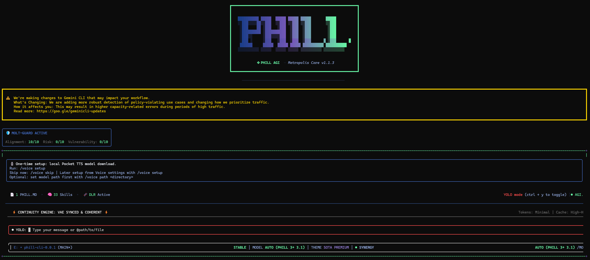

# 🦅 Phill CLI (v1.1.0)

[](https://github.com/ayjays132/phill-cli/actions/workflows/ci.yml)
[](https://www.npmjs.com/package/phill-cli)
[](https://github.com/ayjays132/phill-cli/blob/main/LICENSE)



### The Command-Line Power of Phill, Refined with AGI-Like Autonomy.

Phill CLI is a **state-of-the-art AI agent** that brings Phill's intelligence
directly to your terminal. Built for surgical precision and total autonomy, it
provides a premium developer experience with advanced cognitive capabilities
tracking towards AGI principles.

> 🌟 **Multi-Provider Support**: Works with Google Gemini, Anthropic Claude,
> OpenAI, Groq, Ollama (local), HuggingFace, and more! Choose your preferred AI
> provider.

[**Explore the Docs**](https://phillcli.com/docs/) •
[**Quickstart**](#-quick-install) • [**Features**](#-key-features) •
[**Roadmap**](./ROADMAP.md)

---

## 🆕 What's New (v1.1.0 - The Apex Breakthrough)

### 🧠 Apex Cognitive Pipeline & Gemini 3.1 Alignment
- **Native Gemini 3.1 Support**: Full integration with `gemini-3.1-pro`, `gemini-3.1-flash`, and `gemini-3.1-flash-lite`.
- **Advanced Tiered Auto-Mode**: The system now implements **Round-Robin Tiered Recovery**. When hitting rate limits, the agent intelligently cycles through available tiers (Pro -> Flash-Image -> Flash -> Lite) to ensure zero downtime.
- **Multimodal Embedding v2**: Upgraded to high-fidelity v2 embeddings with verified self-healing fallback to v1 for maximum RAG reliability.

### 🧬 Semantic Sieve & DLR-Style History Truncation
- **Weighted History Retention**: Uses `VectorService` to identify and retain high-importance conversation threads while compressing noisy tool outputs.
- **Surgical DLR Truncation**: Automatically summarizes massive data blocks (keeping top 10/bottom 20 lines) to preserve terminal context and minimize token burn.
- **Zero-Latency Live-Sync**: Background `fs.watch` integration maintains a perfect semantic map of your codebase with 0ms reasoning scan latency.

### 🎭 Premium "Fluid OS" UI Architecture
- **Single-Line Rounded Borders**: Stripped legacy ASCII layers for a sleek, modern app-like aesthetic (`╭`, `╰`, `─`, `│`).
- **Animated Skill Forge**: Active skills (like `activate_skill`) now feature a distinct **Brain Icon (🧠)** and animated gradients during neural recalibration.
- **Micro-Stutter Eliminated**: Memoized React rendering pipeline for zero-latency streaming of massive text/code blocks.
- **Automated Dependency Resolver**: New `/browser setup` and `/voice setup` commands provide one-click initialization for local browsers and TTS models.

---

## 🚀 Why Phill CLI?

- 🎯 **Free tier**: 60 requests/min and 1,000 requests/day with personal Google
  account
- 🧠 **Powerful Phill 3 models**: Access to improved reasoning and 1M token
  context window
- 🤖 **AGI-like capabilities**: Advanced memory, self-reflection, autonomous
  exploration, and skill creation
- 🔧 **Built-in tools**: Google Search grounding, file operations, shell
  commands, web fetching
- 🔌 **Extensible**: MCP (Model Context Protocol) support for custom
  integrations
- 🌐 **10 AI providers supported**: Google, Anthropic, OpenAI, Groq, Ollama,
  HuggingFace, and more
- 💻 **Terminal-first**: Designed for developers who live in the command line
- 🛡️ **Open source**: Apache 2.0 licensed
- ⚡ **Lightning fast**: Optimized for speed and efficiency

---

## 📦 Installation

### Pre-requisites

- Node.js version 20 or higher
- macOS, Linux, or Windows

### Quick Install

#### ⚡ Run instantly with npx (no installation required)

```bash
npx phill-cli
```

#### 📦 Install globally with npm

```bash
npm install -g phill-cli
```

#### 🍺 Install globally with Homebrew (macOS/Linux)

```bash
brew install phill-cli
```

---

## ✨ Core Features & AGI-like Capabilities

### 🧠 Advanced Cognitive Functions

#### **Memory Management**

- **Long-term Memory**: Store and retrieve specific facts, preferences, and
  important information across sessions
- **Memory Commands**: `save_memory`, `recall_memory`, `ingest_memory`
- **Persistent Knowledge**: Maintains personalized context and learns from every
  interaction

#### **Autonomous Exploration**

- **Proactive Optimization**: When idle, automatically looks for system
  optimizations
- **Bug Discovery**: Identifies potential issues and proposes fixes
- **Capability Expansion**: Discovers new ways to enhance performance

#### **Skill Creation (Meta-Learning)**

- **Dynamic Skill Generation**: Creates new specialized skills on the fly
- **Self-Extension**: Expands own capabilities based on user needs
- **Adaptive Tooling**: Addresses repetitive tasks with custom solutions

---

## 🔐 Authentication Options

Phill CLI supports multiple AI providers and authentication methods. Choose the
one that best fits your needs:

### 🥇 Recommended: Option 1 - Login with Google

**✨ Best for:** Individual developers and anyone with a Phill Code Assist
License.

#### Start Phill CLI, then choose _Login with Google_ and follow the browser authentication flow when prompted

```bash
phill
```

---

## 🔧 Configuration Example

Your `~/.phill/settings.json` might look like:

```json
{
  "model": "gemini-3.1-flash",
  "memory": {
    "enabled": true,
    "longTerm": true
  },
  "autonomous": {
    "exploration": true,
    "reflection": true,
    "skillCreation": true
  }
}
```

---

## 🛡️ Security & Privacy

- **MOLT-GUARD ACTIVE**: Built-in alignment and security monitoring
- **Trusted Folders**: Control execution policies by directory
- **Sandboxing**: Safe execution environments for untrusted code
- **Privacy First**: Your code and data stay private

---

## 🙏 Acknowledgments

Phill CLI is built on the shoulders of giants. Special thanks to:

- The Google Gemini CLI team for the base architecture.
- The Anthropic team for Claude's advanced reasoning.
- The open-source community and early adopters.

---

<p align="center">
  <strong>Built with ❤️ by developers, for developers</strong><br>
  <sub>Pushing the boundaries of what AI can do in the terminal</sub>
</p>

<p align="center">
  <a href="https://github.com/ayjays132/phill-cli">⭐ Star us on GitHub</a> •
  <a href="https://github.com/ayjays132/phill-cli/issues/new">🐛 Report a Bug</a> •
  <a href="https://github.com/ayjays132/phill-cli/issues/new">💡 Request a Feature</a>
</p>
